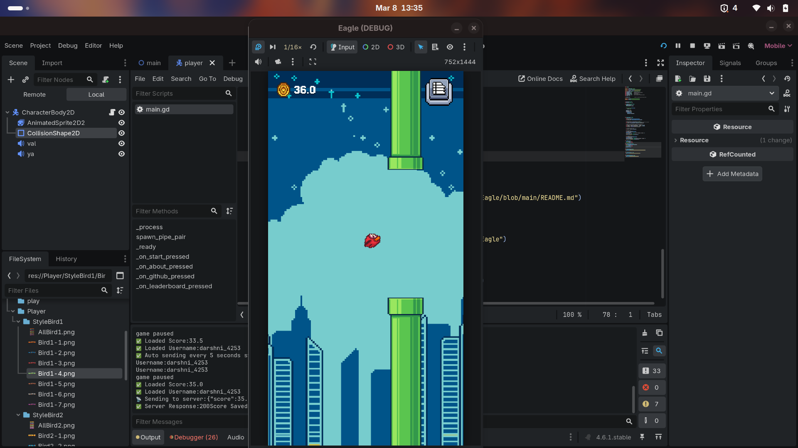
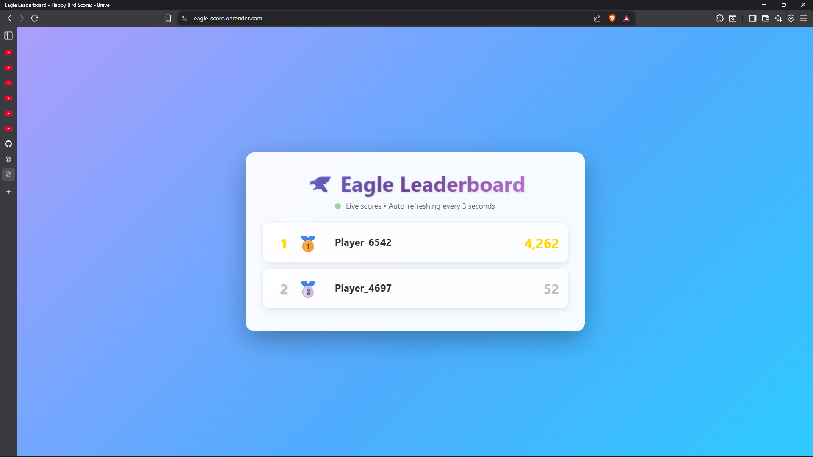
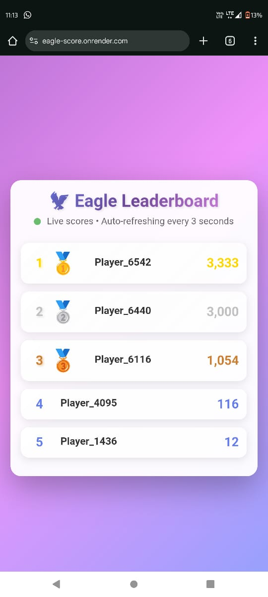
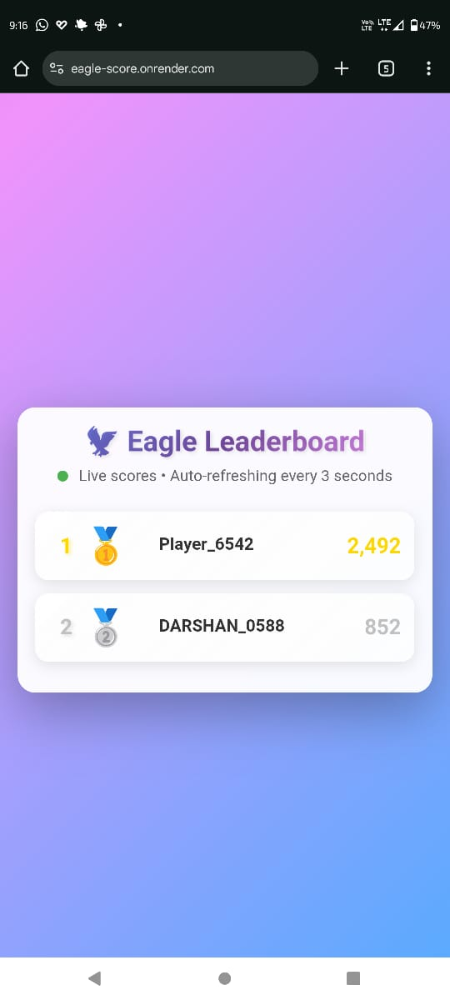
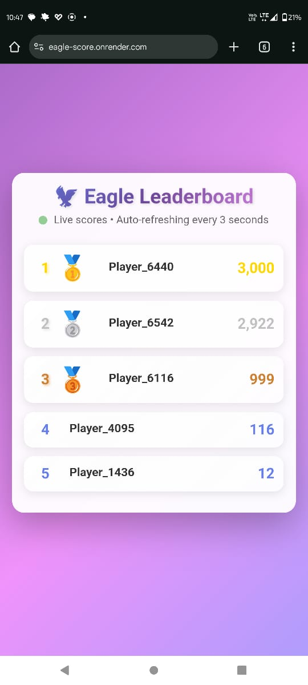
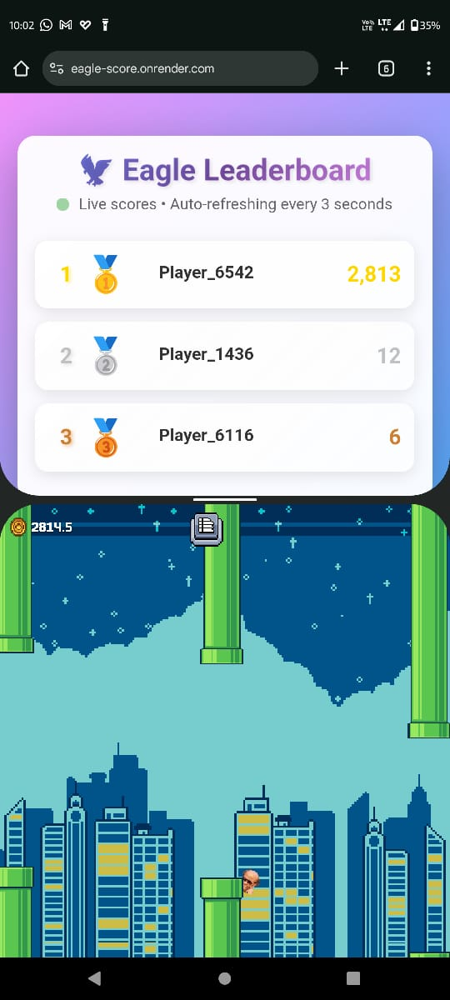
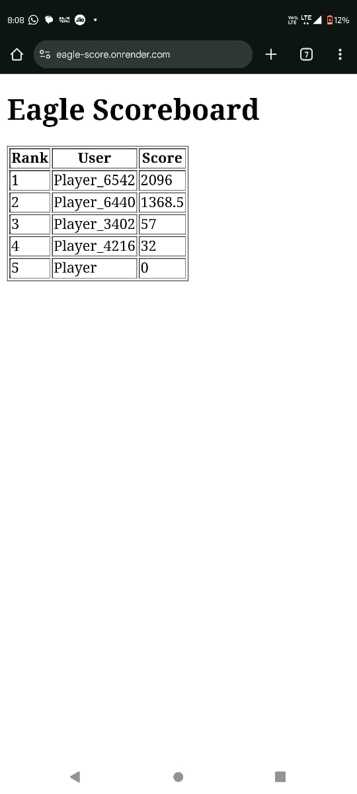
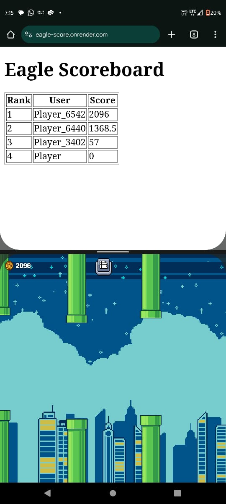

# 🦅 **Eagle – A Fast & Fun Flappy Bird Style Game**

Welcome to **Eagle**, a lightweight and fast-paced **Flappy Bird–inspired game AKA Parody** built using **Godot 4.3**.  
Tap, flap, dodge, survive  and compete to get the highest score!

---

###  **Download Eagle on PlayStore**

### 🏆 **Online Leaderboard**

 
 

### 🚀 **Download Eagle APK**

### 📁 **Server Repo for the Online Leaderboard**

### 🫂 **Privacy Policy**

---

## 🎮 **Gameplay Preview**

---
## Eagle – A Fast, Addictive Arcade Game

**Eagle** is a lightweight, fast-paced arcade game inspired by classic tap-to-fly mechanics. You control a small eagle navigating through endless obstacles, where timing and reflexes are everything. The longer you survive, the faster the game gets, making each run more intense than the last.

It’s designed for quick sessions but has that “just one more try” feeling that keeps you coming back.

---

## How It Plays

On mobile, you simply tap anywhere on the screen to keep the eagle in the air.  
On PC, you can use the **Space** or **Enter** key to do the same.

The goal is straightforward: avoid the pipes and stay alive as long as possible.  
There are no complicated mechanics, just pure reaction and rhythm.

---

## Tech Stack

Built using **Godot** with **GDScript**, keeping the game lightweight, smooth, and easy to expand.

---

## Screenshots

  
  
  
  
  
  

---

## Contributing

If you have ideas to improve gameplay, visuals, or overall feel, feel free to open a pull request. Small tweaks or big changes, everything is welcome.

---

## Support

If you enjoyed the game, consider starring the repository. It genuinely helps and keeps the project moving forward.
