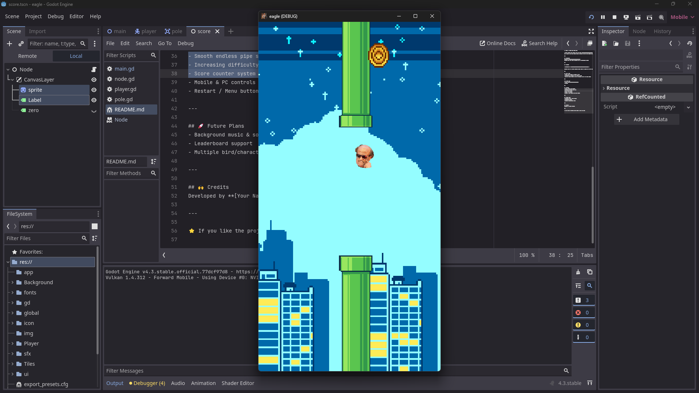

# 🦅 Eagle – A Flappy Bird Style Game

A simple **Flappy Bird clone** made with [Godot Engine](https://godotengine.org/).  
Tap or click to flap your wings, avoid the pipes, and aim for the highest score!  

---

## 📸 Screenshot
  

---

## 📥 Download

👉 **[Download APK here](https://github.com/Divya-Darshan/Eagle/raw/refs/heads/main/app/eagle.apk)** 👈  

 

---

## 🎮 How to Play
- **PC**: Press `Space` or `Enter` to flap  
- **Mobile**: Tap anywhere on the screen to flap  
- Avoid the pipes, survive as long as possible, and set a new high score!  

---

## 🛠️ Built With
- [Godot 4.3](https://godotengine.org/)  
- GDScript  

---

## 📌 Features
- Smooth endless pipe spawning  
- Increasing difficulty over time  
- Score counter system  
- Mobile & PC controls  
- Restart / Menu buttons with pause support  

---

## 🚀 Future Plans
- Background music & sound effects  
- Leaderboard support  
- Multiple bird/character skins  

---

## 🙌 Credits
Developed by **[Divya-Darshan](https://github.com/divya-darshan)**

---

⭐ If you like the project, don’t forget to star the repo!
